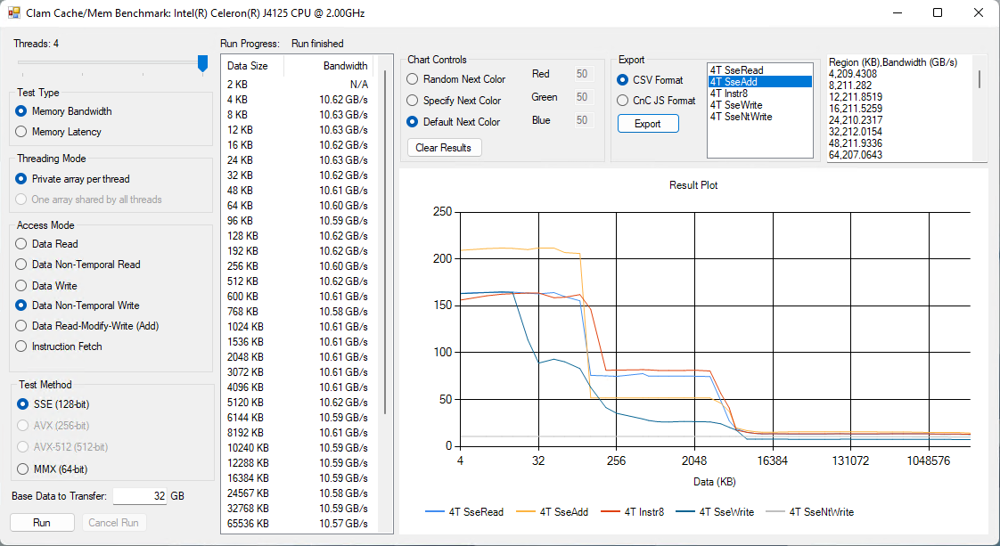
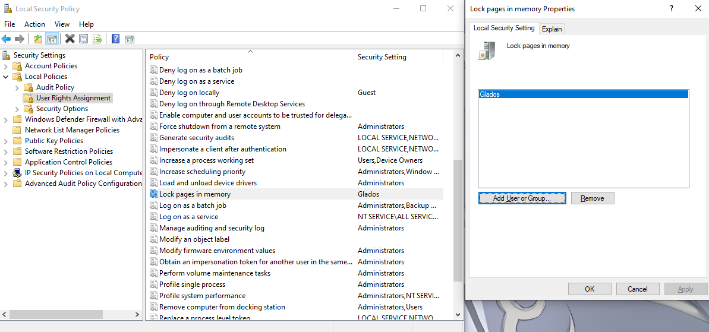

# Microbenchmark GUI, currently cache and memory benchmark
Started as a GUI project for https://github.com/clamchowder/Microbenchmarks, ended as a simple cache and memory benchmark because covering any more would require a hideous amount of GUI code. I'm not trying to imply the GUI code is anything but hideous, by the way :P

Unlike another well known cache and memory benchmark that's spelled AIDA, this aims to be a free and more advanced tool. It runs through a lot of tests sizes designed to cover most cache capacities. Then, you can look through the results to determine bandwidth and latency for each level in the memory hierarchy.

It also provides more control over what's being tested. You can select whether SSE, AVX, AVX-512, or even MMX is used. You can test instruction fetch bandwidth, like in the screenshot above. And you can control how many threads are used.

Non-goals:
- Make results comparable to AIDA's. I don't know what they're doing anyway.
- Automatically determine bandwidth and latency at different cache levels. I think this is a shortcoming with AIDA since it seems prone to generating erroneous results with new CPU releases. Zen 3 with 96 MB of vertically stacked L3 is a good example.
- Provide any kind of support. Not enough hours in a day, not enough free time :(

# Building
Get NASM (https://www.nasm.us/) and make sure it's in your path. Then things should build under Visual Studio 2019 or 2022.

# Memory Bandwidth Options
Most of these should be self explanatory. Anything that might require more explanation:

### Threading Mode
- Private array per thread: Each thread gets its own array. You'll see bandwidth drop off after the sum of private cache sizes are exceeded.
- One array shared by all threads: All threads read from the same array. You'll see bandwidth drop off after cache accessible to one core is exceeded, because data will be duplicated across private caches.

### Access Mode
- Data Non-Temporal Read: Non-temporal means accesses don't have good temporal locality. In other words, once a location has been accessed, it's going to be a long time before it'll be accessed again, so don't bother caching it. If checked, `movntdqa` is used to load data. It doesn't seem to behave differently from regular reads, as far as this test is concerned.
- Data Non-Temporal Writes: Non-temporal writes tend to behave very differently and bypass caching, using a write-combining memory model even if the region isn't marked write combining by the OS. This typically results in higher write bandwidth to memory, at the expense of not benefitting from cache.
- Instruction fetch: Fills an array with the specified instructions, terminates it with a `ret`, and jumps to it. You can specify four different ways to fill the array:
    - 4B NOPs (0F 1F 40 00): 4 byte NOP recommended for padding in AMD optimization guides for Bulldozer and later. 4 bytes is representative of instruction length in typical integer code. Good for testing instruction fetch bandwidth in terms of IPC.
    - 8B NOPs (0F 1F 84 00 00 00 00 00): 8 byte NOP recommended for padding, as with above. 8 bytes is representative of very long instructions, which can come up when dealing with large immediates or AVX/AVX2/AVX-512 ISA extensions. Good for testing instruction fetch bandwidth in bytes/cycle.
    - Taken Branch per 16B: Each 16B block has an unconditional jump that jumps to the next 16B block. Good for testing BTB capacity.
    - 4B NOPs (66 66 66 90): 4 byte NOP recommended by an old AMD Athlon optimization guide. Strangely, Athlons seem to do fine with the 0F 1F 40 00 NOPs, but some sorta old Intel CPUs benefit from this.

# Memory Latency Options

## Access Mode
- Simple addressing: instruction uses a register's value as a pointer to read from memory
- Indexed addressing (C): C compilers like to compile `current = arr[current]` into an instruction that uses indexed addressing. In other words, the instruction specifies a base register and an index register. The CPU must add them together to get the final address used to access memory. On some CPUs, this indexed addressing mode creates an extra cycle of latency.

## Paging Mode
Most applications have memory mapped for them in 4 KB pages, which reduces wasted memory and fragmentation. Memory can also be mapped in 2 MB pages. Windows calls this "Large Pages", while Linux calls it "Huge Pages". 2 MB pages let TLB size go further, since each cached virtual to physical address translation works with a 2 MB aligned block of memory, rather than a 4 KB one.

You can use 2 MB pages to minimize address translation penalties, letting you see L2 and L3 cache latency more clearly. However, this is a bit trick to do on Windows. You need to give your account the "Lock pages in memory" privilege:

If you've logged in with a non-local account, you can also give "Everyone" the privilege.

Then if you select Large Pages under Paging Mode, the test will allocate 1 GB (the largest test size for mem latency) upfront and run all test sizes within that. That means you need to have 1 GB of contiguous memory free. If you have a system without much memory that has been running for a while, you might have to reboot before allocation will succeed.

Have fun!